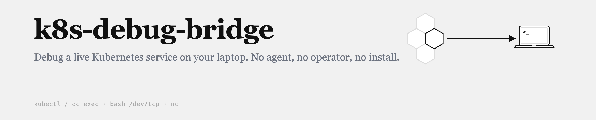
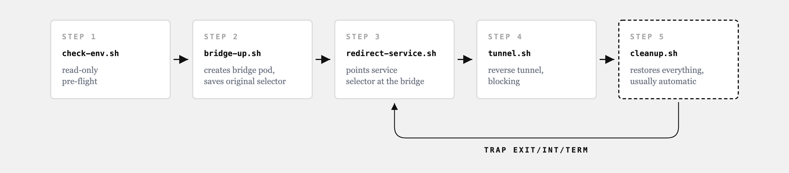

# k8s-debug-bridge

**Debug a live Kubernetes service on your laptop. No agent, no operator, no install.**

[](https://github.com/bilgihankose/k8s-debug-bridge/actions/workflows/tests.yml) [](LICENSE) [](https://agentskills.io)

Set a breakpoint in your IDE, then let **real traffic from a real cluster** hit it. Five bash scripts point a Service's selector at a temporary bridge pod and tunnel that traffic to `localhost` — using nothing but `kubectl`/`oc exec`, bash's built-in `/dev/tcp`, and the `nc` already inside the pod image.

```bash
npx skills add bilgihankose/k8s-debug-bridge
```

---

## The problem

A bug only reproduces with the cluster's real data, real tokens, real neighbors. So you change code → commit → wait for CI → deploy → try to trigger it again → fail → repeat. Minutes per attempt, sometimes hours. Mocking the twenty services around you is a project of its own, and the mocks drift until "worked locally, broke in the cluster" comes back.

Traffic interception fixes this: stop *reproducing* the bug, watch the actual request hit your breakpoint.

## Why not Telepresence or mirrord?

Use them if you can — they're good, and for full-environment transparency they're better than this. But they're not free:

| | Installs into your cluster | Host/kernel privileges | Extra CLI to learn |
|---|---|---|---|
| **Telepresence** | Traffic Manager + mutating webhook | — | yes |
| **mirrord** | agent pod per session | `CAP_NET_ADMIN`, `CAP_SYS_PTRACE`, `CAP_SYS_ADMIN` | yes |
| **k8s-debug-bridge** | nothing permanent — one temp pod, deleted on exit | none | no |

In a regulated cluster those requirements are often what gets a tool rejected. This one runs inside the RBAC a normal developer already has: create a pod, exec into it, patch a Service in your own namespace.

The long version — how each tool actually works, what each costs, and when to pick which — is in the article: **[Read the full write-up](https://medium.com/@bilgihankose/routing-kubernetes-traffic-to-localhost-without-extra-dependencies)**.

> ⚠️ **This touches real cluster state.** `bridge-up.sh` creates a real Pod and `redirect-service.sh` repoints a real Service — from that moment the real pods stop receiving traffic. An AI agent running this must tell you what it's about to do and get your approval before *both* steps. If it doesn't, stop it.

## Install

The one-liner at the top goes through the [skills.sh](https://skills.sh) CLI, which pulls this repo straight from GitHub into your agent's skill directory. It works across Claude Code, Codex, Cursor, Copilot, Windsurf and Gemini, because [Agent Skills](https://agentskills.io) is an open standard — one `SKILL.md`, no per-agent adapter.

<details>
<summary>Install by hand instead</summary>

The whole repo (`SKILL.md` + `scripts/` + `assets/`) **is** the skill package. Clone it and drop the folder in place:

```bash
git clone https://github.com/bilgihankose/k8s-debug-bridge.git
```

| Agent | Where the folder goes |
|---|---|
| Claude Code — every project | `~/.claude/skills/k8s-debug-bridge/` |
| Claude Code — one project | `<your-project>/.claude/skills/k8s-debug-bridge/` |
| Codex, Gemini CLI/Antigravity, Cursor, others | your agent's documented skill directory |

Keep the folder named `k8s-debug-bridge` — it must match the `name:` field in `SKILL.md`'s frontmatter. `AGENTS.md` is a separate standard (general repo context, e.g. for Codex); copy it to your project root if you want, the Skill works without it.

</details>

## Quick start

No AI agent required — these are plain bash scripts:

```bash
oc login ...                          # or: kubectl config use-context <cluster>

scripts/check-env.sh dev              # lists services + their targetPort (e.g. 8000)

# start your local app on that port first, then confirm it's listening:
lsof -nP -iTCP:8000 -sTCP:LISTEN

scripts/bridge-up.sh       dev auth-service my-bridge nicolaka/netshoot 8000
scripts/redirect-service.sh dev auth-service          # asks for a "yes"
scripts/tunnel.sh          dev auth-service my-bridge 8000   # blocking — own terminal

# breakpoints now catch live cluster traffic.
# Ctrl+C in the tunnel terminal → selector restored, bridge pod deleted, automatically.
```

Attach your debugger to the *app*, separately, on its own port (Go: Delve on 2345; Node: `--inspect`; Python: debugpy). The bridge only moves bytes — it doesn't care what language you're in.

**Local side not set up yet?** [`docs/local-debug-setup.md`](docs/local-debug-setup.md) is the recipe: the three requirements your local app has to satisfy, a working Go setup (Air + Delve, with the `.air.toml` and `launch.json` that matter), the equivalent entry points for Node, Python, JVM and .NET, and what to expect during a session — hot reloads freeing the port, held breakpoints holding real requests. It ships with the skill, so an agent can follow it and adapt it to your project.

**Want a worked example?** The article walks through a complete Go setup — installing Air and Delve, the `.air.toml` and `launch.json` contents, and hot reload with the debugger attached, end to end: **[read it here](https://medium.com/@bilgihankose/routing-kubernetes-traffic-to-localhost-without-extra-dependencies)**.

Traffic doesn't have to arrive through a public Route or Ingress. **Any** in-cluster caller of that Service is intercepted too — a dashboard's Nginx doing `proxy_pass http://auth-service/` lands on your breakpoint just the same.

## How it works



Each script does one thing and hands off. `cleanup.sh` is dashed because you rarely call it yourself — `tunnel.sh` traps `EXIT`/`INT`/`TERM` and runs it for you.

**Get `<port>` right.** Once the selector points at your bridge pod, kube-proxy forwards to that pod's **`targetPort`** — not the Service's client-facing `port`, and not some free port you picked. Use the number `check-env.sh` prints; resolve named ports (`http`) to their numeric container port.

`oc` or `kubectl` is auto-detected (`scripts/lib-kube-cli.sh`); force it with `KUBE_CLI=oc` / `KUBE_CLI=kubectl`.

**Output.** Colour and the `▸`/`✓` markers appear only when you are looking at a terminal — piped output, CI logs and AI-agent transcripts get plain ASCII, so nothing downstream has to strip escape codes. `NO_COLOR=1` (or `TERM=dumb`) turns styling off everywhere.

## Requirements

| What | Why |
|---|---|
| `kubectl` or `oc`, logged in | No cluster-admin. Just `create`/`get`/`delete` on `pods`, `create` on `pods/exec`, and `get`/`list`/`patch` on `services` — in your own namespace. |
| A pod image shipping **`nc`** | Something must listen inside the pod and hand bytes to `exec`'s stdin/stdout. `nicolaka/netshoot` or `busybox` will do. `nc` rather than socat on purpose: hardened corporate images strip `socat` while keeping `nc`. `tunnel.sh` checks before opening the tunnel. |
| **Nothing on your machine** | The local half is `<>"/dev/tcp/127.0.0.1/<port>"` + `>&0`, a bash built-in. No socat, netcat, python or jq. (`/dev/tcp` is bash-specific, not POSIX — the scripts declare `#!/usr/bin/env bash`.) |
| Routes/Ingress + VPN, if your app calls out | Only inbound traffic is bridged. Your local app can't resolve `.svc.cluster.local`, so point dependencies at external addresses. |
| Local env vars, provisioned safely | Values like `JWT_SECRET` must match the cluster — but never read them out of a pod with `oc exec ... env`. Multiline credentials leak into terminal and agent logs. Use your team's secret workflow. |

**Paths are not rewritten.** The bridge copies bytes; it does not emulate an Ingress rewrite. Your local app's base prefix must accept the path the Service actually receives — prove it with an existing endpoint before testing a new one.

## Running on Windows

The scripts are bash, so the shell matters more than the OS:

| Environment | Status |
|---|---|
| **WSL2** | Works like any Linux. Recommended. |
| **Git Bash / MSYS2** | Expected to work — bash there supports `/dev/tcp`, and `sed`/`tr`/`paste`/`whoami` are all present. `pkill` is missing, so `cleanup.sh` skips its leftover-process sweep and tells you so; the PID-based shutdown still runs. **Not verified by the author — reports welcome.** |
| **PowerShell / cmd** | Does not work. These are bash scripts, not portable shell. |

Where the docs say `lsof -nP -iTCP:8000 -sTCP:LISTEN`, the Windows equivalent is `netstat -ano | findstr :8000`.

## Customizing the bridge pod

The pod is rendered from [`assets/bridge-pod.yaml`](assets/bridge-pod.yaml). `__BRIDGE_NAME__`, `__IMAGE__` and `__PORT__` get substituted at apply time; the rest is yours — `imagePullSecrets`, a `securityContext`, `nodeSelector`/tolerations, different resource limits — no need to touch the scripts.

Two things must stay: the `debug: "__BRIDGE_NAME__"` label (what `redirect-service.sh` targets) and the container name `debug-bridge` (what `tunnel.sh`/`cleanup.sh` exec into).

## Limitations — honestly

- **One connection at a time.** A single `exec` gets both ends of one socket, which is what makes the channel duplex. Concurrent requests queue rather than interleave. Great for debugging one request; not for load testing.
- **Inbound only.** No transparent DNS/network like Telepresence gives you. Outbound calls from your local app need external Routes, a VPN, or `port-forward`.
- **Selector-based Services only.** Headless Services with hand-managed `Endpoints` and `ExternalName` Services have no selector to repoint; `bridge-up.sh` stops with "selector could not be read or is empty".
- **Cleanup is a convention, not a gate.** The `trap` covers Ctrl+C and TERM, and the owner annotation stops a second person from clobbering your bridge — but `kill -9` leaves it up, and the reminder to clean up lives in the agent prompt, not a hook. (Hook formats differ across Claude Code, Codex and Antigravity, and the Stop event is unreliable in some versions, so it was deliberately left out.)
- **The owner lock isn't atomic.** Two people starting in the same second can still race past the annotation check. It's a practical safeguard, not a distributed lock.
- **Breakpoints hold real traffic.** Pause longer than the caller's timeout and that request times out — on a shared dev/stage cluster, someone may notice.

## Reporting a problem

Please [open an issue](https://github.com/bilgihankose/k8s-debug-bridge/issues). What actually helps narrow it down:

- your cluster (OpenShift / vanilla / EKS-GKE-AKS) and `kubectl` or `oc` version
- your OS **and shell** — `/dev/tcp` is a bash feature, so this matters more than usual
- the bridge pod image you passed, and whether `nc` exists in it: `kubectl exec <bridge-pod> -n <ns> -- sh -c 'command -v nc'`
- the output of `scripts/check-env.sh <namespace>` (it prints no secrets)

**Windows reports are especially welcome** — the scripts are expected to work under WSL2 and Git Bash but the author has not verified either.

If a bridge is left behind while you debug the issue, `scripts/cleanup.sh <namespace> <service>` restores the Service.

## Contributing

The scripts are covered by [bats](https://github.com/bats-core/bats-core) tests with a mocked `kubectl` (`tests/`), and CI runs shellcheck over everything. Note that `tests/agent-instructions.bats` guards the safety wording in `SKILL.md` / `AGENTS.md` — those files are read by an AI agent, so a reworded approval step is a behaviour change. If you need to change one of those sentences, update the test in the same PR.

The only worked language example so far is Go + Air + Delve, written up in [the article](https://medium.com/@bilgihankose/routing-kubernetes-traffic-to-localhost-without-extra-dependencies). The bridge itself is language-agnostic, so an equivalent walkthrough for Node, Python or Java is the most useful thing you could contribute — open a PR.

## License

MIT — see [LICENSE](LICENSE).
